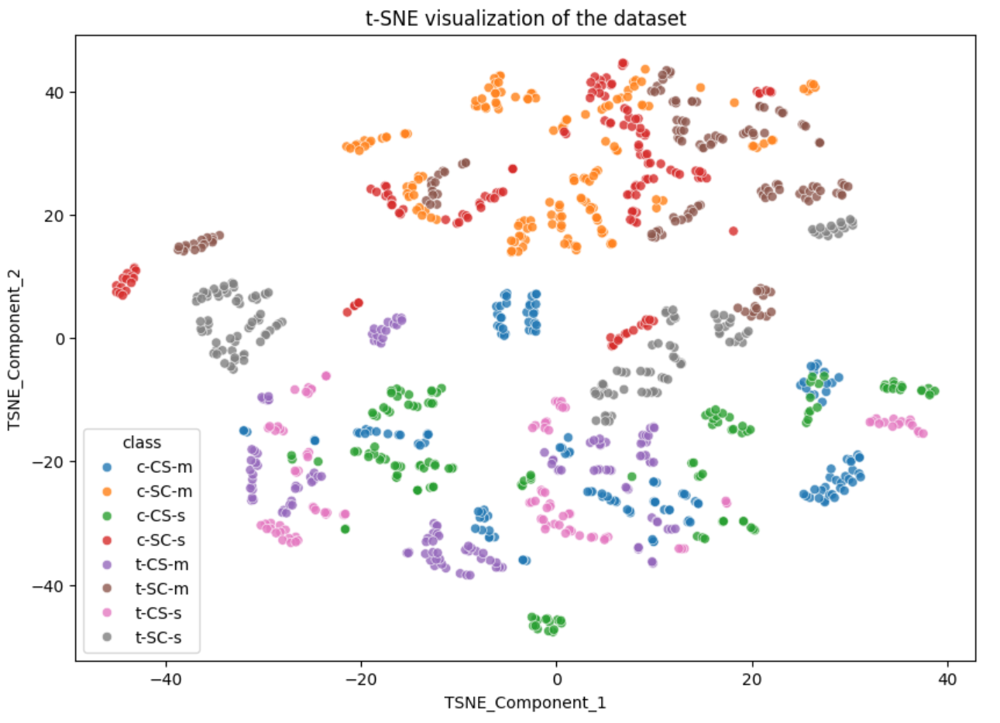
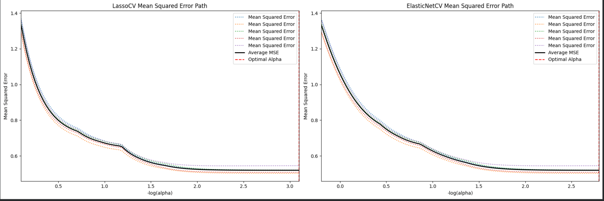
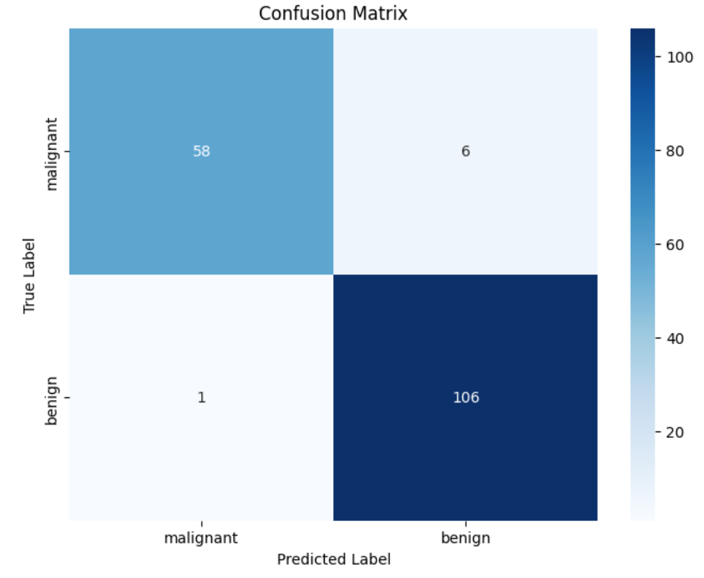
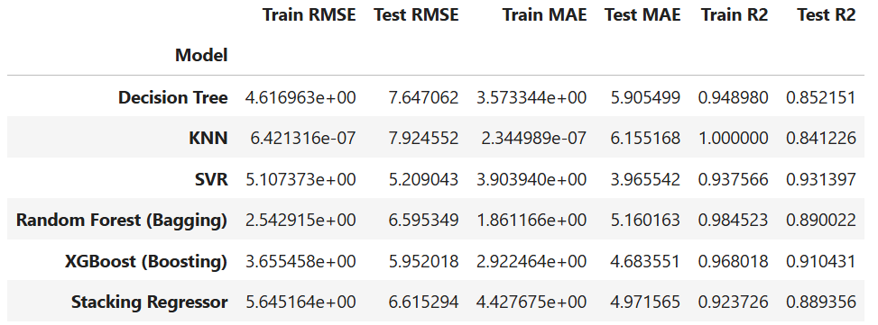
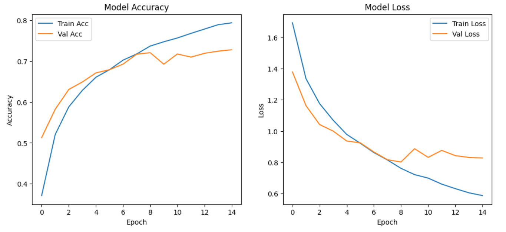

# erika-s_portfolio-

# Overview

Welcome Curious Traveler to my public GitHub repository showcasing assignments and projects completed during my Master's degree in Data Science and Data Analytics. This portfolio demonstrates my expertise in various data science techniques, from foundational data preprocessing to advanced deep learning applications and ensemble methods.

## Featured ML Projects

Here are some highlights from my coursework, demonstrating a diverse skill set:

* [Deep Neural Networks Training](https://github.com/edommer/erika-s_portfolio-/blob/main/Machine_Learning/Project%202%20_%20Training_Deep_Neural_Networks.ipynb): This project demonstrates expertise in deep learning and neural networks, a highly sought-after and modern skill in the AI field.

  

* [Protein Expression PCA](https://github.com/edommer/erika-s_portfolio-/blob/main/Machine_Learning/Test%202%20P3%20_%20protein-expression-pca.ipynb): Principal Component Analysis (PCA) is a core dimensionality reduction and data preprocessing technique, showing strong foundations in data preparation and statistical methods.

  

* [Predicting House Prices with Regularization](https://github.com/edommer/erika-s_portfolio-/blob/main/Machine_Learning/Week%206%20Assignment%20(SVM%20and%20Training%20Models)%20P1%20_%20Predicting%20House%20Prices%20w%20Regularization.ipynb): This is a classic, practical machine learning problem (regression) with a business application. The inclusion of regularization highlights an understanding of model tuning and preventing overfitting.

  

* [Breast Cancer Classification w/ SVM](https://github.com/edommer/erika-s_portfolio-/blob/main/Machine_Learning/Week%206%20Assignment%20(SVM%20and%20Training%20Models)%20P2%20_%20Breast%20Cancer%20Classification%20w%20SVM.ipynb): This project combines a significant real-world, high-impact application (healthcare/cancer detection) with a robust algorithm (SVM), demonstrating the ability to handle critical classification tasks.

  

* [Screen Time vs Mental Wellness Ensemble & Stacking Methods](https://github.com/edommer/erika-s_portfolio-/blob/main/Machine_Learning/Week%208%20Assignment%20(Ensembles%20and%20Stacking)%20-%20Regression%20Dataset.ipynb): This shows proficiency in advanced techniques like ensemble methods, which often provide superior performance and demonstrate a deeper understanding of machine learning strategies.

  

* [CIFAR10 Neural Network (P2)](https://github.com/edommer/erika-s_portfolio-/blob/main/Machine_Learning/Week%2012%20Assignment(Intro%20to%20ANN)%20P2%20_%20Neural_Network_Assignment_CIFAR10%20P2.ipynb): This assignment focuses on the application of neural networks to the CIFAR10 image classification dataset, demonstrating skills in handling image data and training models for computer vision tasks.

  

## Featured Data Science Projects

* (This is pending my friend, will upload soon)

